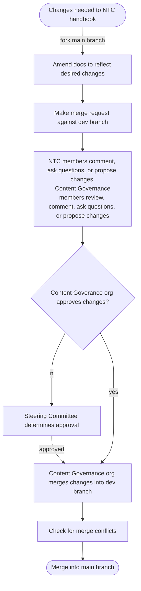

# Contributing to the Handbook

This is plain language explanation of how to contribute to the handbook. It is meant to reflect the more formal expression of rules laid out in the [National Tech Committee Handbook Content Governance Policy](https://github.com/dsausa/gov-docs/blob/main/handbook-content-governance-policy.md).

Want to make a contribution to the handbook? It's easy! Just follow these simple steps.

1. Fork the handbook to a new branch.
2. Make your changes to that branch.
3. Push your commit to the `dev` repo and initiate a pull request.
4. Publicize your contribution on the NTC Slack and request feedback from your peer contributors.
5. The Handbook Content Governance team will review your contribution. They may ask questions or make suggestions. You should feel free to engage with them and try to get your contribution to a state that will pass their approval process.
6. Once your contribution pass approval it will be merged by the HCG team into the master branch.

## Visualization

> From the forum
>
> All Handbook pages are Wiki posts to empower NTC members to all contribute
> to actively documenting our practices, policies, projects, and any other
> knowledge that may need to be known. Members are responsible for ensuring
> Project documentation and any relevant Handbook pages for their practice
> area are kept up to date, under the direction of their Project’s Lead and
> Subcommittee liason.
>
> To edit a Handbook page, navigate to the Forum topic and click the :memo:
> Edit button at the bottom of each post. This will open up the Forum’s
> markdown editor screen where you can begin updating a document.
