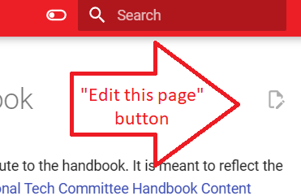
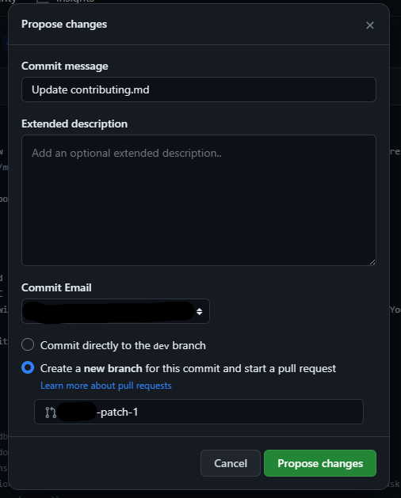
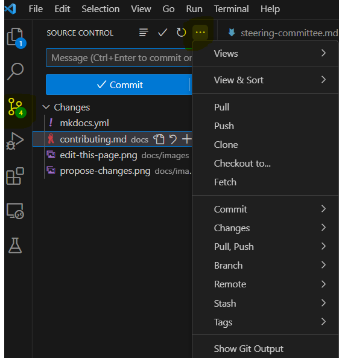
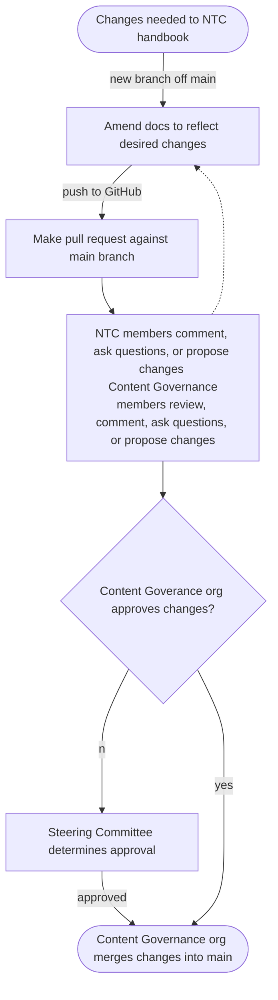

# Contributing to the Handbook

Thank you for your interest in improving our handbook! This page will go over, as plainly as possible, how you can help us document our policies, procedures, and best practices for the NTC as we trailblaze a path forward in support of the socialist movement. For a more formal and democratic perspective on the inception, motivation, and maintenance of this handbook and our governing documents themselves, please see [National Tech Committee Handbook Content Governance Policy](../documents/gov-docs).

!!! note "Markdown"

    The handbook is written in [Markdown](https://www.markdownguide.org/), a simple and intuitive markup language. It's designed to be easy to type and read while translating neatly to HTML, allowing us to be more intentional and organized with our content instead of spending too much time on formatting and styling. While most of the basics are simple, there are some more advanced features such as the Markdown used to write this info block. Later, if                                                       you open the Markdown for this page, see if you can figure out how it works!

*[markup language]: A language that uses special characters to indicate formatting and structure for text-based documents

## Mkdocs and Mkdocs Material

The handbook is built using [Mkdocs](https://www.mkdocs.org/), a static site generator that converts Markdown files into HTML. The theme we use is called [Mkdocs Material](https://squidfunk.github.io/mkdocs-material/), which also provides a number of pleasant features such as the search bar, tabbed content, and info boxes.
*[static site]: This website is *static* because it can be fully rendered from a simple set of files. There is no backend database and only the simplest forms of user interaction afforded to us by HTML and CSS.
Mkdocs reads the text content for the site pseudo-directly from GitHub, so any changes to the Markdown (.md) files in the `main` branch on our GitHub repo are reflected on the site.

## Minor changes (low/no code)

{ align=right }

If you have a GitHub account, minor changes to the handbook can be easily accomplished via the GitHub user interface. If you see a typo, broken link, or have some helpful information to add, click the "Edit this page" button on the upper right of the page.

{ align=right width=50% }

This will take you directly to a Markdown editor on GitHub. Make your desired changes, be sure to preview the rendered version, and then click the green "Commit changes" button. 


At this point you will be presented with a "Propose changes" window where you may elaborate on your changes if necessary. Select "Create a new branch" in order to segregate your changes from other potentially concurrent changes on the team. Finally, selecting "Propose changes" will create a pull request that will be reviewed by the Handbook Content Governance team.

*[pull request]: A request to merge your changes into another git branch

For most contributors and contributions, this should be sufficient. 

## Major changes (code setup)

Major changes to the handbook such as architectural changes, fancy documentation features, or complex process outlines might require some light programming or help from a more experienced contributor. Here's how you'll get set up:

### Codespaces vs Dev Containers

GitHub Codespaces is a relatively new feature from GitHub that allows you to create a cloud-based development environment that is accessible from any computer with a web browser. This is a great option for new programmers or those who don't want to (or need to) install the project on their personal computer. GitHub has a generous (but limited) free tier for usage of Codespaces on your personal GitHub account. However, if you have some programming experience and would like to work on your local machine, follow the Dev Container instructions below.

Regardless of which setup you choose, many of the configuration steps to work on the handbook are provided in `.devcontainer/devcontainer.json`. This file is used by both Codespaces and Dev Containers to set up your development environment. Take a peek if you're curious!

!!! info "IDEs"

    This guide assumes you are using [Visual Studio Code](https://code.visualstudio.com/) as your IDE/code editor, however, Codespaces and Dev Containers are compatible with JetBrains IDEs as well. If you prefer a different IDE, consider contributing to the handbook by adding instructions for your preferred IDE!

### Initializing your environment

=== "Codespaces (cloud)"

    To create a codespace, click the green "Code" button on the upper right of the repository page and select "Create codespace on main". Wait for the codespace to be created; when it has loaded, familiarize yourself with the project layout. While a codespace will open in the browser by default, once loaded, there is a menu option to open it in VS Code if you prefer the standalone app.

=== "Dev Containers (local)"

    Make sure you have [Docker Desktop](https://www.docker.com/products/docker-desktop), [VS Code](https://code.visualstudio.com/) and its [Dev Containers extension](https://marketplace.visualstudio.com/items?itemName=ms-vscode-remote.remote-containers) installed. Then, clone the repository:

    ```
    git clone https://github.com/dsa-ntc/handbook.git
    ```
    
    Open the project in VS Code. You should see a notification that a dev container configuration file was detected. Click "Reopen in Container" to initialize your environment. If you don't see this notification, you can open the command palette (Ctrl+Shift+P) and search for "Remote-Containers: Reopen in Container".


!!! note "Terminal vs GUI"

    { align=right width=50% }
    The following git commands are intended to be executed in your terminal. While it's never a bad time to get more comfortable with the command line (and [learn enough to be dangerous](https://www.learnenough.com/command-line-tutorial)), learning git *and* the command line simultaneously can be frustrating for beginners. Alternatively, VS Code has a built-in GUI for git that is sufficient for the following tasks.


### GitHub Flow

Our handbook uses a specific, simple *git workflow* called *GitHub Flow*. Visit our dedicated page on [git and version control](../participating/git-review) for more information; or if you know what you're doing:

1. Branch off of latest `main` and name your branch `<[user]name>/<feature>`.
2. Commit your changes
3. Push your branch to GitHub and open a pull request.


## Change approval process
