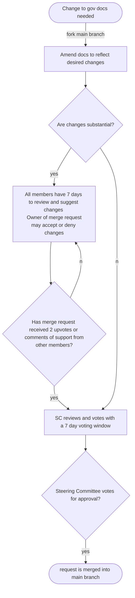

# Governance Docs

* Documents that _describe_ policy go in the [🔒handbook](https://github.com/dsa-ntc/handbook).
* Documents that _define_ policy go in the
[🔒gov docs](https://drive.google.com/drive/folders/1Q02NXa22YlZ1GMreLVUoPgKIliu21DtT?usp=share_link)

How do you make changes to the gov docs? Read the official policy in full
[🔒here](https://docs.google.com/document/d/17ySg1Apj9KHTbXaIyA_F4pqEPRSM6u_qS1GCf97LwvA/edit?usp=sharing).

But in short:

1. NTC member creates a merge request with the changes they want made.
2. 7 days for members to review. At least 2 expressions of support (either a
   thumbs up or a comment to the merge request)
3. SC votes on it async or at a meeting

## Visualization

